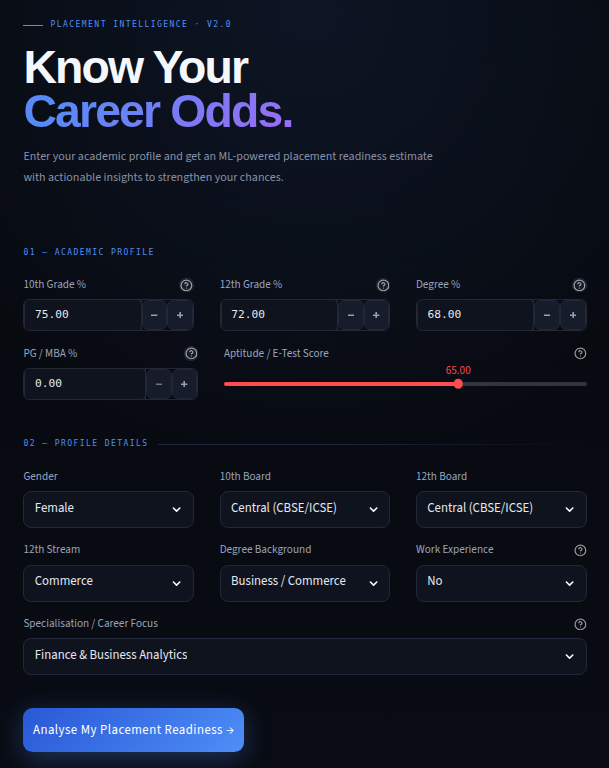
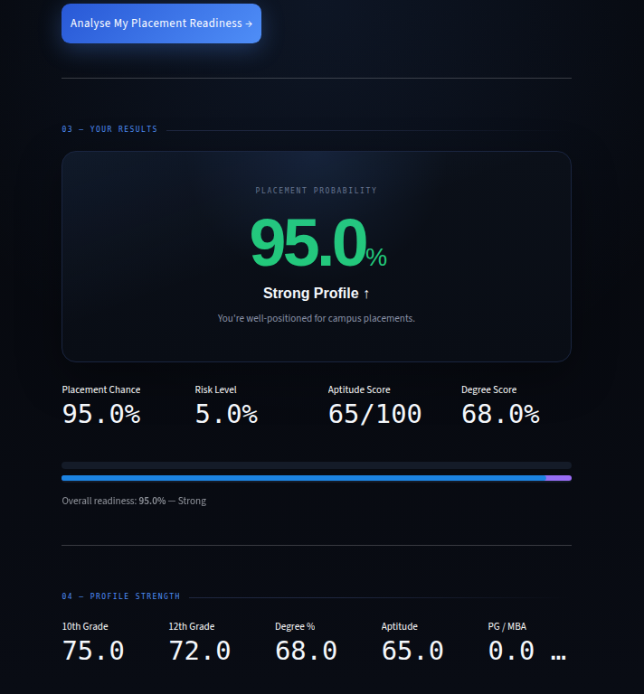
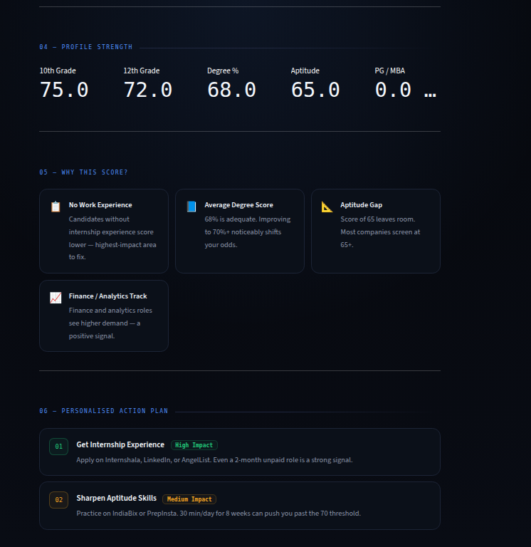

# Placement Intelligence System

[](https://placement-intelligence-system.streamlit.app/)
[](LICENSE)
[](https://python.org)
[](https://scikit-learn.org)
[](https://streamlit.io)

> An ML-powered career readiness estimator that transforms a student's academic profile into a calibrated placement probability score, factor-level breakdown, and a ranked, personalised action plan.

---

## The Problem

Every year, thousands of students enter campus placement season without a clear picture of where they stand. They rely on anecdotes, peer comparisons, and intuition — none of which are reliable signals. The result: poor preparation prioritisation, missed opportunities, and reactive rather than proactive career planning.

**The core question students cannot answer:** *"Given my current profile, what are my real placement odds — and what is the single highest-leverage thing I can do to improve them?"*

---

## The Solution

Placement Intelligence ingests a student's academic and professional profile, runs it through a trained classification model, and returns three concrete outputs:

1. **Placement probability score** — a calibrated percentage grounded in historical placement patterns
2. **Factor breakdown** — which inputs are helping, which are hurting, and by how much
3. **Personalised action plan** — specific, ranked improvement steps ordered by impact-per-effort

The system runs entirely in-browser. No installation, no data submission, no registration required.

---

## Key Findings from the Training Data

Empirical patterns extracted from the dataset — not assumptions:

| Factor | Observed Effect |
|---|---|
| Work experience (internship or part-time) | +27% increase in placement probability |
| Finance or Marketing specialisation vs. HR | +23% higher placement rate |
| Degree percentage ≥ 70% | Strong positive predictor across all models tested |
| Academic consistency (SSC → HSC → Degree) | Upward trajectory matters more than absolute scores |
| Aptitude / E-test score ≥ 65 | Key filter at initial screening stage for most recruiters |

---

## Screenshots

### 01 — Input Form: Academic & Profile Details

<p align="center">
  
</p>

The input form collects 14 features across two sections: academic scores (10th, 12th, degree, PG/MBA, aptitude) and profile attributes (gender, board type, stream, work experience, specialisation). All fields include contextual help tooltips.

---

### 02 — Results: Probability Score & KPI Cards

<p align="center">
  
</p>

The results screen surfaces the probability score as the primary element, followed by four KPI cards — placement chance, risk level, aptitude score, and degree score. The verdict label (Strong / Moderate / Needs Work) and progress bar update dynamically based on the computed probability.

---

### 03 — Deep Dive: Profile Strength, Insights & Action Plan

<p align="center">
  
</p>

Section 04 displays raw academic scores side by side for an at-a-glance profile read. Section 05 surfaces insight cards that explain each factor's contribution to the final score in plain language. Section 06 generates a prioritised action plan — each step labelled by impact tier (High / Medium / Context) with named, specific resources such as Internshala, IndiaBix, and PrepInsta.

---

## Features

- Instant placement probability estimate from a 14-feature input profile
- Visual strength breakdown across all academic dimensions
- Insight cards explaining the model's reasoning in plain language
- Ranked action plan personalised to the user's weakest signals
- Demo mode — fully functional without a model file, using a weighted linear approximation
- No login, no data storage, no tracking

---

## Tech Stack

| Layer | Tool |
|---|---|
| Data processing | Python, Pandas |
| Model training | Scikit-learn (Logistic Regression / Random Forest) |
| Feature scaling | StandardScaler, serialised with joblib |
| Frontend | Streamlit |
| Custom styling | CSS (`styles/main.css`) |
| Deployment | Streamlit Community Cloud |

---

## Project Structure

```
placement-intelligence/
├── app.py                  # Main Streamlit application
├── placement_model.pkl     # Trained classifier (joblib)
├── scaler.pkl              # Fitted StandardScaler (joblib)
├── train_model.py          # Model training script
├── requirements.txt
├── styles/
│   └── main.css            # Custom dark UI theme
└── Assets/
    ├── Starting_screen.png
    ├── Result.png
    └── image.png
```

---

## Run Locally

**Prerequisites:** Python 3.9+

```bash
# Clone the repository
git clone https://github.com/prasadk1628/placement-intelligence-system.git
cd placement-intelligence-system

# Install dependencies
pip install -r requirements.txt

# Run the app
streamlit run app.py
```

The app launches in **demo mode** automatically if `placement_model.pkl` is not present. To use the trained model, run `train_model.py` against your dataset first — it will generate both `placement_model.pkl` and `scaler.pkl`.

---

## Model Details

The classifier was trained on MBA placement data containing academic scores, demographic attributes, work experience indicators, and specialisation labels. Key pipeline steps:

- One-hot and binary encoding for all categorical features (gender, board type, stream, degree background, work experience, specialisation)
- Feature scaling via `StandardScaler` applied before model input
- Target variable: binary placement outcome (placed / not placed)
- Model serialised with `joblib` for production serving

Demo mode uses a weighted linear approximation of the trained model's feature importances, producing directionally accurate estimates without requiring the `.pkl` files.

---

## Limitations

- Training data originates from a single institution — generalisation across colleges and geographies should be treated with caution
- The model reflects historical placement patterns and does not account for current market conditions, interview performance, or interpersonal skills
- Probability outputs are estimates, not guarantees of any outcome

---

## Roadmap

- [ ] Upload your own dataset and retrain in-browser
- [ ] Peer benchmarking — compare against anonymised cohort percentiles
- [ ] Resume gap analysis using NLP on uploaded CVs
- [ ] Recruiter-side view — filter and rank candidate pools by predicted readiness

---

## License

```
MIT License

Copyright (c) 2024 Vara Prasad K

Permission is hereby granted, free of charge, to any person obtaining a copy
of this software and associated documentation files (the "Software"), to deal
in the Software without restriction, including without limitation the rights
to use, copy, modify, merge, publish, distribute, sublicense, and/or sell
copies of the Software, and to permit persons to whom the Software is
furnished to do so, subject to the following conditions:

The above copyright notice and this permission notice shall be included in all
copies or substantial portions of the Software.

THE SOFTWARE IS PROVIDED "AS IS", WITHOUT WARRANTY OF ANY KIND, EXPRESS OR
IMPLIED, INCLUDING BUT NOT LIMITED TO THE WARRANTIES OF MERCHANTABILITY,
FITNESS FOR A PARTICULAR PURPOSE AND NONINFRINGEMENT. IN NO EVENT SHALL THE
AUTHORS OR COPYRIGHT HOLDERS BE LIABLE FOR ANY CLAIM, DAMAGES OR OTHER
LIABILITY, WHETHER IN AN ACTION OF CONTRACT, TORT OR OTHERWISE, ARISING FROM,
OUT OF OR IN CONNECTION WITH THE SOFTWARE OR THE USE OR OTHER DEALINGS IN THE
SOFTWARE.
```

---

## Author

**Vara Prasad K** — B.Tech CSE, Methodist College of Engineering and Technology, Hyderabad

[](mailto:kavalivaraprasad16@gmail.com)
[](https://www.linkedin.com/in/vara-prasad-kavali/)
[](https://github.com/prasadk1628)

---

*This project is built for educational and career guidance purposes. Placement outcomes depend on many factors beyond the scope of this model.*
